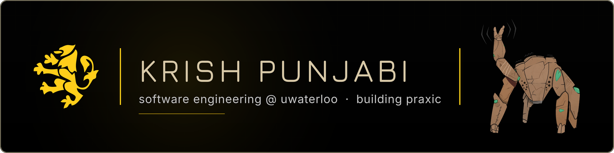

<a href="https://github.com/pulls?q=is%3Apr+author%3AKrishP147+org%3ASkyvern-AI+org%3Aaden-hive+org%3AUWARG"><picture><source media="(prefers-color-scheme: dark)" srcset="https://raw.githubusercontent.com/KrishP147/KrishP147/output/oss-prs.svg" /></picture></a>
<!-- oss-prs badge: org-owned repos only (owner type Organization), closed-unmerged excluded; generated by scripts/stats.py every 6h -->

## About
<!-- titles updated 2026-09-23 -->

Software Engineering @ UWaterloo, building **Praxic**: turning how teams actually work into automations that run themselves.

- co-founder & CTO @ **Praxic**
- prev SWE intern @ **Ciena**, AI/ML agents
- prev autonomy software @ **WARG**, [target tracking + MAVLink control](https://github.com/KrishP147/ML-CV-Target-Tracking)
- open-source contributor @ [**Skyvern**](https://github.com/Skyvern-AI/skyvern/pulls?q=is%3Apr+author%3AKrishP147)
- 2× 2nd place: [YHack '26](https://github.com/KrishP147/godseye) (Polymarket track) · [Amazon Robotics Hackathon](https://github.com/KrishP147/ArHackathon2025)
- programming hobbyist

## Stack

  

  

  

Also: Triton · CUDA graphs · Google ADK · Gemini · SAM 2 · Modal · MAVLink

## Contribution Activity

<picture>
  <source media="(prefers-color-scheme: dark)" srcset="https://raw.githubusercontent.com/KrishP147/KrishP147/output/github-snake-dark.svg" />
  
</picture>

<!-- refreshed every 6h by .github/workflows/stats.yml -->
<picture>
  <source media="(prefers-color-scheme: dark)" srcset="https://raw.githubusercontent.com/KrishP147/KrishP147/output/stats-dark.svg" />
  
</picture>

